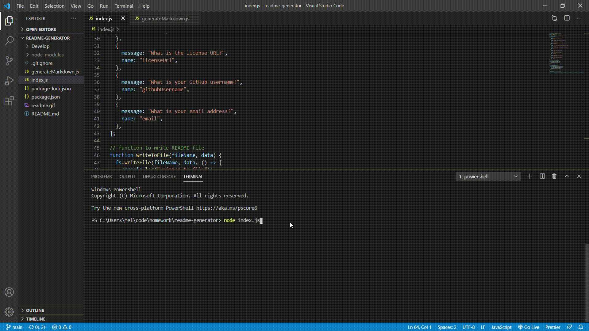

# Title: **stuff about things**

  &nbsp;
  &nbsp;
  ## Description:

  **a project to work on stuff and thigns**

  &nbsp;
  &nbsp;
  ## Installation: 

  *node*

  &nbsp;
  &nbsp;
  ## Contributors: 
  
  **ick**

  &nbsp;
  &nbsp;
  ## Test: 
  
  **poke it with a stick**

  &nbsp;
  &nbsp;
  ## License: 
  
  MIT

  &nbsp;
  &nbsp;
  ## License URL: 
  https://www.mit.com

  &nbsp;
  &nbsp;
  ## GitHub UserName:
  
  @rick-smart

  &nbsp;
  &nbsp;
  ## Email: 
  
  **rick@rick.com**

  &nbsp;
  &nbsp;
  # Screen Shots
  &nbsp;
  &nbsp;
  
  &nbsp;
  &nbsp;
  
  &nbsp;
  &nbsp;
  # Video Clip
  &nbsp;
  &nbsp;
  
  &nbsp;
  &nbsp;
  
